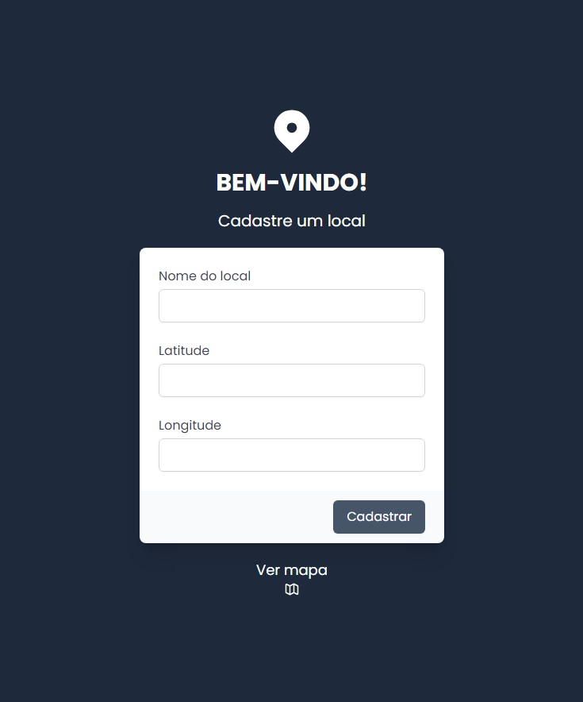

<!-- 

 -->

# Sistema de cadastro de localidades 🗺

Esse é um desafio proposto por uma empresa para uma vaga de estágio de desenvolvedor full stack web, da qual fiz parte na candidatura. Gostei do resultado e do projeto em si.

## Tabela de conteúdos

- [Visão geral](#visão-geral)
  - [O desafio](#o-desafio-)
  - [Screenshot](#screenshot-)
- [Meu Processo](#meu-processo)
  - [Feito com](#feito-com-)
  - [Desenvolvimento contínuo](#desenvolvimento-contínuo-)
  - [Recursos úteis](#recursos-úteis-)
- [Autor](#autor-%EF%B8%8F)
- [Agradecimentos](#agradecimentos-)

## Visão geral

### O desafio ⚡

> Texto transcrito da própria página do desafio  

Para o back-end você pode utilizar a tecnologia de sua preferência, será necessário 2 RESTs:
1. Um REST para cadastrar uma localidade contendo (nome, latitude e longitude);
2. Um REST que lista todas as localidades cadastradas;

Para o front-end você poderá fazer um site com html e javascript padrão, ou poderá utilizar Angular ou React. Para os mapas você precisa utilizar a biblioteca Leaflet, o site deverá conter 2 páginas:
1. Uma página onde você terá 1 formulário para cadastrar uma localidade.
2. Uma página com um mapa que listará e mostrará as localidades no mapa com um marker.

### Screenshot 📷

## Meu Processo 

### Feito com ⚙

- Semantic HTML5 markup
- Flexbox
- TailwindCSS framework
  - Lib de ícones (Heroicons)
  - Lib de form (Tailwind Forms)
- Mobile-first workflow
- [React](https://reactjs.org/) - JS library
- [Firebase](https://firebase.google.com/) - BaaS (Backend as a Service)

### Desenvolvimento contínuo 🎯

- Melhorar integração Frontend de uma aplicação com o Firebase
- Aplicar boas práticas em Typescript

### Recursos úteis ✨

- [React Leaflet](https://react-leaflet.js.org/) - Usei essa lib para uma integração excepcional entre o React e a lib Leaflet

## Autor 🙎🏻‍♂️

- My website - [Link here](https://portfolio-allbertuu.vercel.app/)
- Frontend Mentor - [@allbertuu](https://www.frontendmentor.io/profile/allbertuu)
- LinkedIn - [Alberto Vinícius A. dos Santos](https://www.linkedin.com/in/albertov-albuquerque/)

## Agradecimentos ⭐

Agradeço ao canal gringo [franchyze923](https://www.youtube.com/watch?v=62Y8SFi2wBk&ab_channel=franchyze923) no YouTube. A explicação dele sobre como utilizar melhor o Leaflet com o React foi excelente e caiu em boa hora para mim. [Link do vídeo](https://www.youtube.com/watch?v=62Y8SFi2wBk&ab_channel=franchyze923).

[Voltar para o 🔝](#sistema-de-cadastro-de-localidades-)
